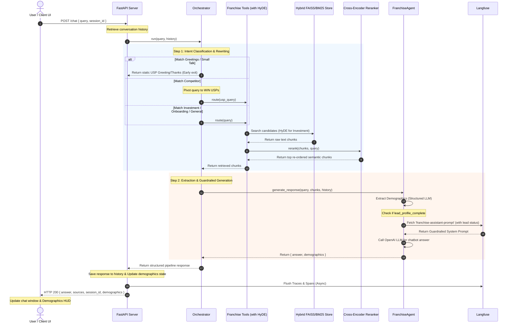

# WIN Franchise Chatbot System: End-to-End Architecture

This document details the architecture, design layers, and execution flow of the **Franchise Chatbot System** for WIN Home Inspection. The chatbot is designed to engage prospective Strategic Partners (SPs), answer questions using a strict Retrieval-Augmented Generation (RAG) pipeline, and conversationally extract prospect demographics with advanced guardrails.

---

## 1. System Architecture Overview

The system is built on a **6-Layer Architecture** designed to isolate the user interface, routing logic, LLM agents, specialized tools, underlying data vector stores, and automated evaluations.

```mermaid
graph TD
    %% Define Nodes
    subgraph UI ["5. Interface Layer (Frontend)"]
        A["React Native / Expo Web Client"]
    end

    subgraph API ["5. Interface Layer (Backend)"]
        B["FastAPI Server (app/main.py)"]
        C["Router (app/router.py)"]
    end

    subgraph ORCH ["4. Orchestration Layer"]
        D["Orchestrator (app/orchestrator.py)"]
        E["Conversation Manager (app/conversation.py)"]
    end

    subgraph TOOLS ["2. Tooling Layer"]
        F["Franchise Tools (app/tools/franchise_tools.py)"]
        G["Franchise Retriever (rag/retrieval/retriever.py)"]
        H["Cross-Encoder Reranker (rag/retrieval/reranker.py)"]
    end

    subgraph AGENT ["3. Agent Layer"]
        I["Franchise Agent (app/agents/franchise_agent.py)"]
        J["Lead Demographic Extractor (Structured Output LLM)"]
    end

    subgraph DATA ["1. Data & Ingestion Layer"]
        K["FAISS Vector Index (vector_store/index)"]
        L["Semantic/Token Chunkers"]
        M["OpenAI Embeddings Generator"]
    end

    subgraph EVAL ["6. Evaluation & Observability"]
        N["Langfuse Server (Dynamic Prompt & Tracing)"]
        O["Automated Eval Scripts (eval_comprehensive.py)"]
    end

    %% Flows
    A <-->|HTTP POST /chat| B
    B <--> C
    C <-->|Query + History| D
    C <-->|Update / Get| E
    D -->|1. Intent Route & USP Pivot| F
    F -->|2. Hybrid Search (FAISS + BM25)| G
    G -->|3. Query Vector + HyDE Strategy| K
    G -->|4. Re-score Chunks| H
    D -->|5. Context + Prompt| I
    I -->|6. Extract Lead Details| J
    I <-->|Fetch Dynamic Guardrailed Prompt| N
    D -.->|Spans & Telemetry Tracing| N
    G -.->|Spans & Telemetry Tracing| N
    I -.->|Spans & Telemetry Tracing| N
    N -.-> O
```

---

## 2. The 6-Layer Breakdown

### Layer 1: Data & Ingestion Layer (`rag/`)
Responsible for web scraping, loading document manuals, parsing table components, chunking, embedding, and indexing.
* **Ingestion Scripts**: Located in `rag/ingestion/`, they scrape target web domains and load docx files.
* **Automated Semantic Chunking Pipeline**: Uses `rag/chunking/semantic_chunker.py` and `scripts/process_kb_semantically.py` to segment text while preserving deep semantic context and deduplicating chunks automatically.
* **Embeddings**: Uses `OpenAI` `text-embedding-3-small` with exponential backoff (`rag/embeddings/pipeline.py`).
* **Vector Store**: A localized `FAISS` index saved under `vector_store/index`. Normalized vectors ensure cosine similarity calculations are exact.

### Layer 2: Tooling Layer (`app/tools/` & `rag/retrieval/`)
Isolates the data retrieval from the agent, exposing simple query interfaces. Uses an increased `MAX_CONTEXT_TOKENS` and `TOP_K_RERANK` for enhanced context retrieval.
* **`get_franchise_info`**: The primary RAG retriever search tool using Hybrid FAISS/BM25 retrieval.
* **`get_investment_details`**: Employs a 0-latency **HyDE (Hypothetical Document Embeddings)** query strategy to perfectly overlap with financial and setup table chunks (Chunks 87-92) in the vector database.
* **`get_process_steps`**: Runs an optimized RAG query focused on the onboarding process, timeline, and training steps.
* **`fallback_no_answer`**: Provides a standard response when inquiries go out-of-bounds.
* **Reranking**: Uses a localized HuggingFace Cross-Encoder model (`BAAI/bge-reranker-large`). This model is **pre-downloaded during the Docker build process** to optimize container startup times.

### Layer 3: Agent Layer (`app/agents/`)
Generates context-rich responses with strict guardrails and dynamic prompt routing based on the lead's state.
* **`FranchiseAgent`**: Formats the context into numbered sources while ensuring the text remains within budgets.
* **Strict Guardrails**: Enforces stringent prompt guardrails for competitor pivoting, lead gating on all questions (triggering based on the `lead_profile_complete` status), and official website data accuracy. Uses conversational phrasing for business opportunities and privacy reassurance.
* **Lead/Demographics Extraction**: Utilizes LangChain's structured output parser (`extractor_llm`) with Pydantic schemas in the background to detect `name`, `email`, `phone_number`, `pin_code`, and `address`.

### Layer 4: Orchestration Layer (`app/orchestrator.py` & `app/conversation.py`)
Classifies user intent, manages session state, and actively rewrites queries.
* **Intent Classification & Competitor Pivoting**: Uses highly-optimized regex patterns to identify small talk, greetings, investment questions, and onboarding questions. Crucially, **competitor queries are intercepted and rewritten** to highlight WIN's Unique Selling Propositions (USPs).
* **Conversation Management**: Implements an in-memory sliding-window manager (`conversation_manager`) using a `deque` with a configurable message history limit. Old messages are discarded when the history exceeds limits.

### Layer 5: Interface Layer (`frontend/` & `app/main.py`)
Exposes endpoints and powers the client UI.
* **FastAPI Server**: Main entrypoint `app/main.py` configuring middleware rules and serving routers.
* **React Native / Expo Web Client**: A mobile-friendly interactive interface. Features styling components, auto-scrolling message streams, session-resets, and a live visual card showing extracted demographic data (`DemographicsCard.js`).

### Layer 6: Evaluation & Testing Layer (`scripts/` & `eval_comprehensive.py`)
A comprehensive automated testing suite ensuring accuracy and guardrail compliance.
* **Evaluation Scripts**: Includes `eval_comprehensive.py`, `scripts/evaluate_chatbot.py`, `test_llm.py`, and orchestration tests to rigorously evaluate retrieval metrics, generative answers, and guardrail effectiveness. Results are tracked systematically in `evaluation_results.json`.

---

## 3. End-to-End Execution Flow

When a user types a message in the UI, the following sequence occurs:



---

## 4. Observability & Prompt Management (Langfuse)

A dedicated telemetry module (`app/utils/langfuse_client.py`) traces execution and enables dynamic prompt editing without deploying new code:
1. **Dynamic Prompts**: System prompts are fetched from Langfuse, adjusting dynamically if a lead profile is complete or incomplete, enforcing strict gating.
2. **Telemetry Spans**: High-level spans wrap the root chatbot run, tool execution, retrieval, vector embedding generation, and LLM text generation.
3. **Cost & Latency Audits**: Logs input/output token counts, model identifiers, response latencies, and demographics extraction events to track production system health.
