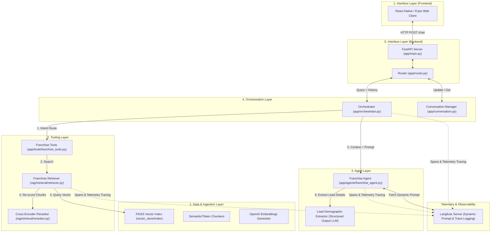
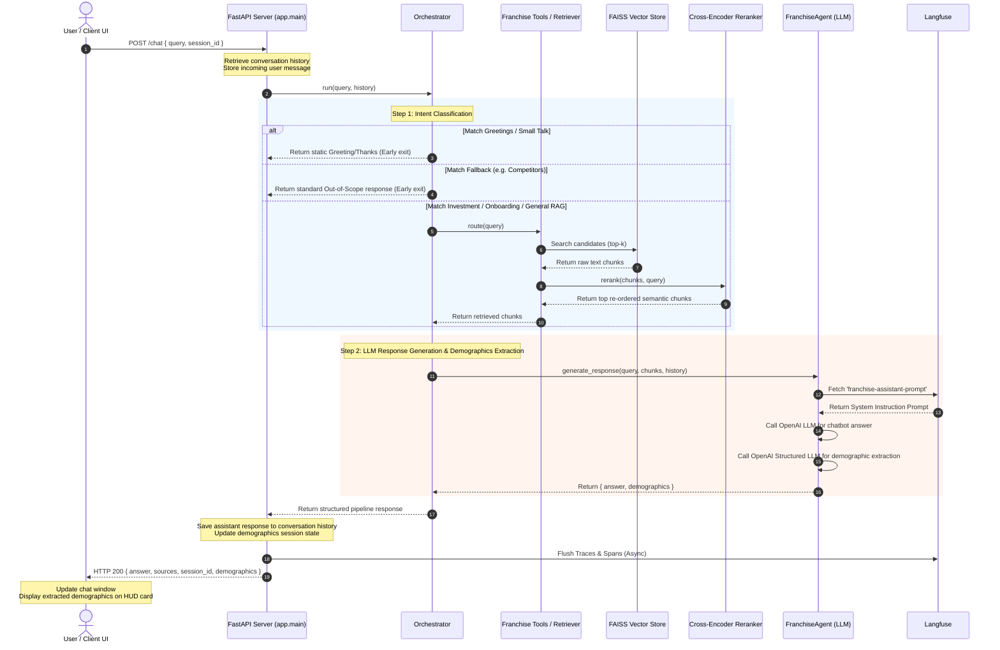

# WIN Franchise Chatbot System: End-to-End Architecture

This document details the architecture, design layers, and execution flow of the **Franchise Chatbot System** for WIN Home Inspection. The chatbot is designed to engage prospective Strategic Partners (SPs), answer questions using a strict Retrieval-Augmented Generation (RAG) pipeline, and conversationally extract prospect demographics.

---

## 1. System Architecture Overview

The system is built on a **5-Layer Architecture** designed to isolate the user interface, routing logic, LLM agents, specialized tools, and underlying data vector stores.

---

## 2. The 5-Layer Breakdown

### Layer 1: Data & Ingestion Layer (`rag/`)
Responsible for web scraping, loading document manuals, parsing table components, chunking, embedding, and indexing.
* **Ingestion Scripts**: Located in `rag/ingestion/`, they scrape target web domains and load docx files.
* **Chunking**: Uses `rag/chunking/semantic_chunker.py` and `token_chunker.py` to segment text while maintaining semantic context.
* **Embeddings**: Uses `OpenAI` `text-embedding-3-small` with exponential backoff (`rag/embeddings/generator.py`).
* **Vector Store**: A localized `FAISS` index saved under `vector_store/index`. Normalized vectors ensure cosine similarity calculations are exact.

### Layer 2: Tooling Layer (`app/tools/`)
Isolates the data retrieval from the agent, exposing simple query interfaces.
* **`get_franchise_info`**: The primary RAG retriever search tool.
* **`get_investment_details`**: Runs an optimized RAG query tailored to financial, setup, and fee calculations.
* **`get_process_steps`**: Runs an optimized RAG query focused on the onboarding process, timeline, and training steps.
* **`fallback_no_answer`**: Provides a standard response when inquiries go out-of-bounds (e.g., questions about competitors).
* **Reranking**: Uses a localized HuggingFace Cross-Encoder model (`BAAI/bge-reranker-large`) in `rag/retrieval/reranker.py` to re-score vector results for high accuracy.

### Layer 3: Agent Layer (`app/agents/`)
Generates context-rich responses with strict guardrails.
* **`FranchiseAgent`**: Formats the context into numbered sources (`[Source 1]`, `[Source 2]`, etc.) while ensuring the text remains within token budgets.
* **Dynamic Prompts**: Fetches the system instructions dynamically from Langfuse (`franchise-assistant-prompt`).
* **Lead/Demographics Extraction**: Utilizes LangChain's structured output parser (`extractor_llm`) with Pydantic schemas in the background to detect when a prospect mentions details like `name`, `phone_number`, `pin_code`, or `address`.

### Layer 4: Orchestration Layer (`app/orchestrator.py` & `app/conversation.py`)
Classifies user intent and routes incoming queries.
* **Intent Classification**: Uses highly-optimized regex patterns to identify small talk, greetings, expressions of thanks, investment questions, onboarding process questions, and competitive/fallback inquiries.
* **Conversation Management**: Implements an in-memory sliding-window manager (`conversation_manager`) using a `deque` with a configurable message history maximum. Old messages are automatically discarded when the history exceeds limits.

### Layer 5: Interface Layer (`frontend/` & `app/main.py`)
Exposes endpoints and powers the client UI.
* **FastAPI Server**: Main entrypoint `app/main.py` configuring middleware rules (allowing connections from local dev networks) and serving routers.
* **React Native / Expo Web Client**: A mobile-friendly interactive interface. Features styling components, auto-scrolling message streams, session-resets, and a live visual card showing extracted demographic data (`DemographicsCard.js`).

---

## 3. End-to-End Execution Flow

When a user types a message in the UI, the following sequence occurs:

---

## 4. Observability & Prompt Management (Langfuse)

A dedicated telemetry module (`app/utils/langfuse_client.py`) traces execution and enables dynamic prompt editing without deploying new code:
1. **Dynamic Prompts**: System prompts are fetched from Langfuse. If Langfuse is unreachable, the system automatically falls back to a hardcoded baseline prompt.
2. **Telemetry Spans**: High-level spans wrap the root chatbot run (`franchise-chatbot`), tool execution (`tool_execution`), retrieval (`retrieval`), vector embedding generation (`embedding_generation`), and LLM text generation (`llm_generation`).
3. **Cost & Latency Audits**: Logs input/output token counts, model identifiers, response latencies, and demographics extraction events to track production system health.
